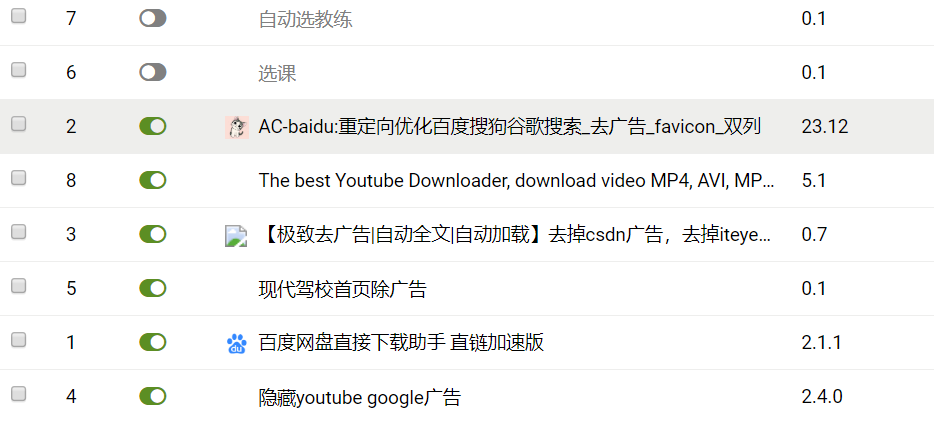
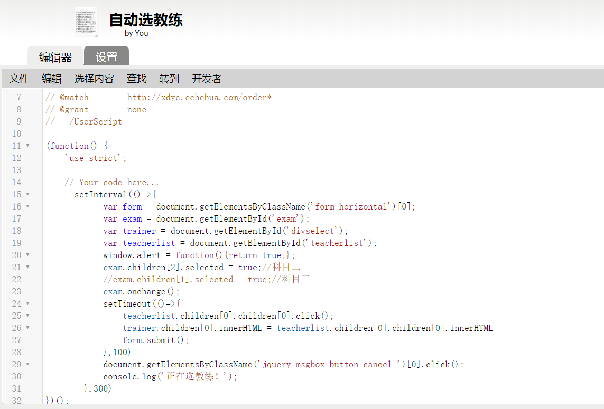
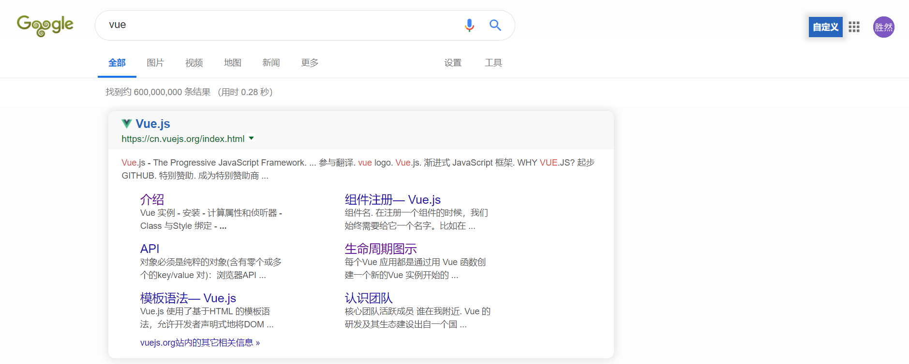
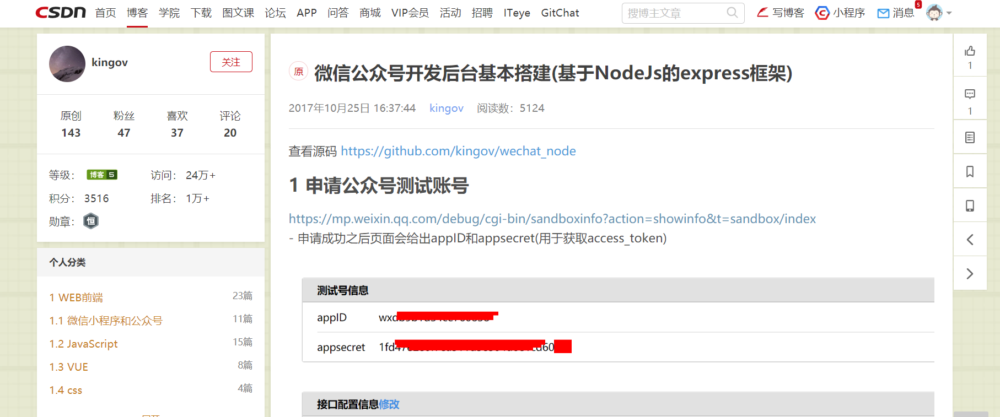

#浏览器配置(chrome)

###插件推荐

__1.作为一名前端工程师，怎么能忍受自己经常逛的网站出现广告呢？工欲善其事必先利其器，是时候自己写点东西去搞掉那些烦人的广告了。__

####工具  油猴插件 

__这是我平时用到的一些插件，有几个是自己写的，有的是开源的，很有用。__

__利用油猴去编写插件是一件很容易的事情，你只需要分析DOM结构，然后对DOM进行相应的操作就可以了。__

###百度、谷歌、CSDN，清爽无比。

