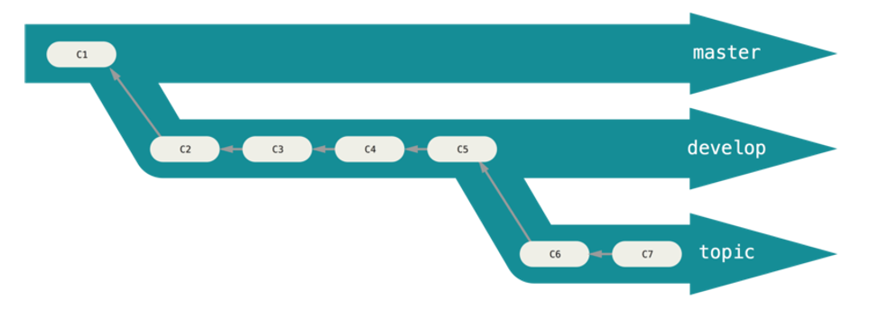

#gitbook

##git使用总结

**1.版本回退**
-- HEAD指向的版本就是当前版本，因此，Git允许我们在版本的历史之间穿梭，使用命令git reset --hard commit_id。

-- 穿梭前，用git log可以查看提交历史，以便确定要回退到哪个版本。

-- 要重返未来，用git reflog查看命令历史，以便确定要回到未来的哪个版本。

**2.工作区和暂存区**

**3.管理修改**

git add填加到暂存区,git commit 添加到版本库,git commit -a = 同时执行git add + git commit

**4.撤销修改**

场景1：当你改乱了工作区某个文件的内容，想直接丢弃工作区的修改时，用命令git checkout -- file。

场景2：当你不但改乱了工作区某个文件的内容，还添加到了暂存区时，想丢弃修改，分两步，第一步用命令git reset HEAD <file>，就回到了场景1，第二步按场景1操作。

场景3：已经提交了不合适的修改到版本库时，想要撤销本次提交，版本回退，使用命令git reset --hard commit_id

 注意git对文件的管理，已经加入版本库控制的，几乎可以恢复，而未加入版本库的文件，使用上述操作后发生不可逆操作。

**5.分支管理**

查看分支：git branch

创建分支：git branch <name>

切换分支：git checkout <name>

创建+切换分支：git checkout -b <name>

合并某分支到当前分支：git merge <name>

删除分支：git branch -d <name>

当克隆一个仓库时，它通常会自动地创建一个跟踪 origin/master 的 master 分支。 如果想把其他分支也拉取下来
查看所有远程分支  git branch -a查看所有远程加本地分支。使用如下命令：
git checkout -b 本地分支名x origin/远程分支名x
使用该方式会在本地新建分支x，并自动切换到该本地分支x。
采用此种方法建立的本地分支会和远程分支建立映射关系。

**删除远程分支**

git push origin - brachName

配置用户信息

git config --global user.name/email ""

查看当前版本管理信息

git status

untracked file 未追踪 ，追踪新文件 git add 

Changes to be committed 表示已经在追踪，且添加到了暂存区，但是未加入到版本库

 Changes not staged for commit 

 表示追踪的文件已经发生了变化但是未添加到暂存区

 查看又修改的文件（未暂存）和版本库的区别， git diff (用小乌龟可视化查看差异比较舒服)

 要查看已经暂存了的和版本库的区别 git diff --cached

 当你没加gitignore不小心把依赖库提交到暂存区，可以 git rm --cached fileName,如果是文件夹，例如node_modules ,可以
 git rm node_modules -r 递归删除 ,而且支持正则通配符 *.js

 追加到上一次提交
 git commit --amend (还允许修改上一次的提交信息)！！！推送到远端之前用！！！

**6.远程仓库的使用**
git 给默认的远程仓库命名未origin 

查看远程仓库 git remote -v

添加远程仓库 git remote add <shortname> <url>

从远程仓库中抓取与拉取，抓取未fetch ，git不会自动将远程分支合并到本地分支，如果想自动合并，可以使用git pull直接拉取

**7.打标签**

git tag -a 标签名 -m"标签详细信息"  （相当于给commit增加了个自己起的名字）

git tag 显示所有标签

git show 标签名  输出显示打标签者的信息、打标签的日期时间、附注信息，然后显示具体的提交信息。

 git tag -a v1.2 9fceb02 后期补标签

 标签默认是不会推送到服务器的，可以使用git push origin --tags把标签推上去

 删标签 git tag -d v1.0

**7.起别名**

git config --global alias.co checkout

**变基**
