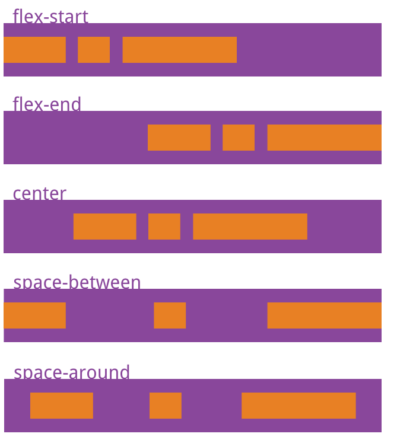
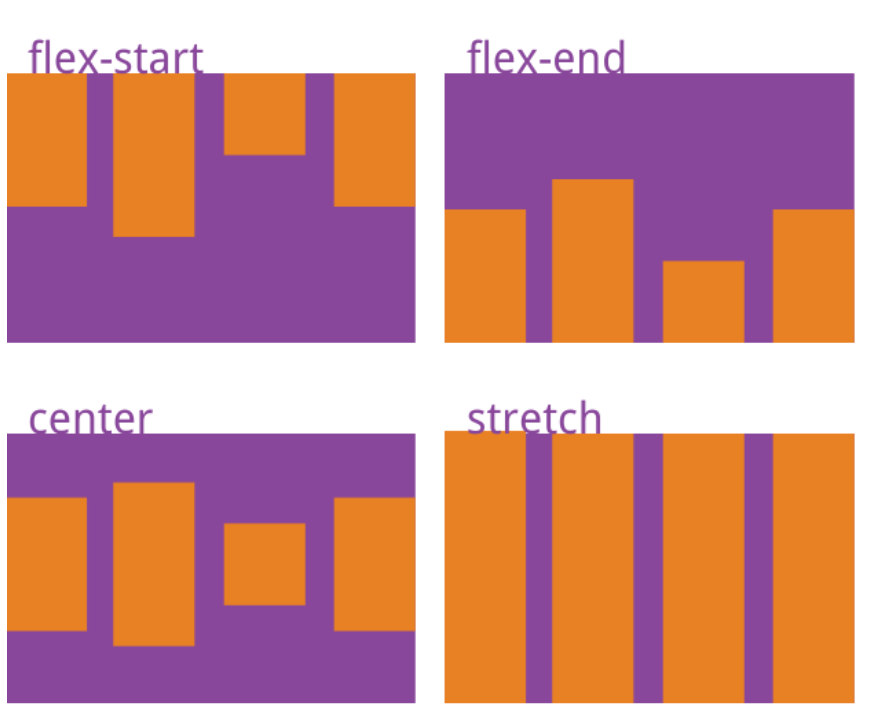

#CSS

##flex布局基础

Flex是弹性布局，为盒状模型提供了极大的灵活性。
使用时，首先设置外置容器，display:flex;(行内元素也可以使用Flex进行布局)
原文摘自[BUNOOB](http://www.runoob.com/w3cnote/flex-grammar.html) 
__可能有的浏览器对Flex布局支持比较差，建议加上前缀__


```css
.box{
  display: -webkit-flex; /* Safari */
  display: flex;
}
```
__需要注意的是，设置为Flex布局后，子元素的float/clear/vertical-align属性将失效__

####容器的属性
__1.flex-direction,主轴方向__
```css
.box {
  flex-direction: row | row-reverse | column | column-reverse;
}
```
__2.flex-warp，主轴是否换行__
默认情况下，项目都排在一条线（又称”轴线”）上。flex-wrap属性定义，如果一条轴线排不下，如何换行。
```css
.box {
  flex-warp:onwrap |wrap | wrap-reverse
}
```
__flex-warp和flex-direction可以简写为flex-flow__
flex-flow属性是flex-direction属性和flex-wrap属性的简写形式，默认值为row nowrap。
__3.justify-content，项目在主轴上的对齐方式(处理横向对齐)__
__(可用于实现俩列布局和三列布局，在需要自适应的项目上不要设置width)__
```css
.box {
  justify-content: flex-start |flex-end |center |space-between |space-around
}
```

__4.align-items，项目在交叉轴上的对齐方式(处理纵向对齐)__
__(可用于实现纵向居中，以前这可是个大难题)__
```css
.box {
  align-items: flex-start |flex-end |center |space-between |space-around
}
```


###项目的属性
__1.order属性__
order属性定义项目的排列顺序。数值越小，排列越靠前，默认为0
__2.flex-grow属性__
flex-grow属性定义项目的放大比例，默认为0，即如果存在剩余空间，也不放大。
__3.flex-shrink属性属性__
在不需要缩小的项目上设置为0即可。（默认为1，空间不足是，全部会缩小）