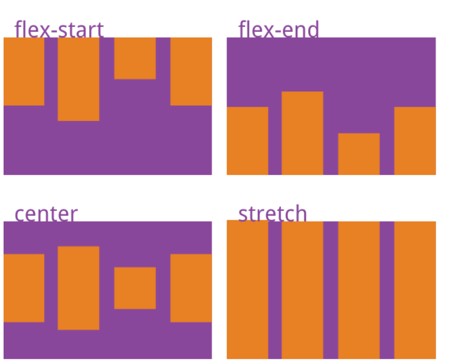

#CSS


###块级元素

p、div、header、footer、ul、li...

###行内元素
input span a img 


##flex布局基础

Flex是弹性布局，为盒状模型提供了极大的灵活性。
使用时，首先设置外置容器，display:flex;(行内元素也可以使用Flex进行布局)
原文摘自[BUNOOB](http://www.runoob.com/w3cnote/flex-grammar.html) 
__可能有的浏览器对Flex布局支持比较差，建议加上前缀__


```css
.box{
  display: -webkit-flex; /* Safari */
  display: flex;
}
```
__需要注意的是，设置为Flex布局后，子元素的float/clear/vertical-align属性将失效__

####容器的属性
__1.flex-direction,主轴方向__

flex-direction属性决定主轴的方向（即项目的排列方向）

```css
.box {
  flex-direction: row | row-reverse | column | column-reverse;
}
```
__2.flex-warp，主轴是否换行__

默认情况下，项目都排在一条线（又称”轴线”）上。flex-wrap属性定义，如果一条轴线排不下，如何换行。
```css
.box {
  flex-warp:onwrap |wrap | wrap-reverse
}
```
__flex-warp和flex-direction可以简写为flex-flow__
flex-flow属性是flex-direction属性和flex-wrap属性的简写形式，默认值为row nowrap。

__3.justify-content，项目在主轴上的对齐方式(处理横向对齐)__

__(可用于实现俩列布局和三列布局，在需要自适应的项目上不要设置width)__
```css
.box {
  justify-content: flex-start |flex-end |center |space-between |space-around
}
```

__4.align-items，项目在交叉轴上的对齐方式(处理纵向对齐)__

__(可用于实现纵向居中，以前这可是个大难题)__
```css
.box {
  align-items: flex-start |flex-end |center |space-between |space-around
}
```


###项目的属性
__1.order属性__
order属性定义项目的排列顺序。数值越小，排列越靠前，默认为0
__2.flex-grow属性__
flex-grow属性定义项目的放大比例，默认为0，即如果存在剩余空间，也不放大。
__3.flex-shrink属性属性__
在不需要缩小的项目上设置为0即可。（默认为1，空间不足是，全部会缩小）


##无聊的各种居中
说起居中，在最近的学习过程中发现网络资源质量太差，如果不去理解的学习，背的再熟也无益。居中在网页布局中是比较常见的，为什么无论从设计师到网民都喜欢呢？大概可能是对称美学，其中中国人尤甚。其实生活中也是一样，不管是建筑还是其他，大多数是对称的。

在各种居中对齐的布局中，不管是水平居中，还是垂直居中，网络教程方法层出不穷，依我看，大致上课】可分为俩类去学习，一类是依靠某种属性，实现自动居中，一类是手动计算进行元素的居中。

先说自动水平居中，作为前端工程师，你起码能说出俩三种方法吧？magin:auto,text-align:center,flex布局设置主轴对齐方式，justify-content:center;这些都会帮你自动实现水平居中对齐。但是在使用过程中，要理解其中的原理，比如你真的理解aoto属性吗？text-align是只对行内元素起作用的（外盒为inline就起作用）。这些还需下去仔细研究。

再说自动垂直居中，起码用过设置line-height去实现文字、行内元素，垂直居中，用过flex的纵轴align-items为center实现居中，块级元素通过设置display为table-cell,然后设置基线vertical-align:middle实现居中。但是在使用过程中，要理解其中的原理，比如你真的理解line-height去实现文字、行内元素垂直居中吗？基线对齐又是怎么回事？。这些也还需下去仔细研究。但是起码心中有数，知道在什么时候使用什么，找到一份能养自己的工作。

接着就是说道手动居中了，这些实现的方法在网上更是层出不穷，总的思路就是不管用什么方法首先将元素的左边缘挪到父元素的中间，在将子元素向左移动子元素一般的宽度即可，可以用margin负值，或者transform，再不济使用定位left: 50%，transform: translateX(-50%);。总之手动计算即可。


###方法总结

####水平自动居中

#####文本/行内元素/行内块级元素  

text-align: center;


#####块级元素
margin: 0 auto;（元素定宽）

#####多个块级元素

```css
#parent{
    text-align: center;
}
.son{
    display: inline-block; /*改为行内或者行内块级形式，以达到text-align对其生效*/
}

```

#####任意个元素(flex)

神器，多学习吧，兼容问题。。。。

####手动居中

自己下去想吧、、

####垂直居中


#####行内元素
设置行高为容器高

```css
#parent{
    height: 150px;
    line-height: 150px;  /*与height等值*/
}


```

基线对齐，基线是个很重要的概念！
```css
#parent{
    height: 150px;
    line-height: 150px;
    font-size: 0; //不清零基线位置不在中心。
}
#son{vertical-align: middle;} /*默认是基线对齐，改为middle*/


```

#####块级元素

通过将父元素设置display为table-cell,然后基线对齐

flex设置交叉轴对齐方式

align-items:center


手动省


**display: none; 与 visibility: hidden; 的区别**

display控制元素是否渲染DOM，visibility控制元素是否显示渲染DOM而且占据空间，但是不显示。

**CSS选择符有哪些？**

-标签选择器
-相邻选择器
-子选择器
-后代选择器
-通配符选择器
-属性选择器（a[rel = "external"]）
-伪类选择器（a:hover, li:nth-child）

**display有哪些值？说明他们的作用**

table、inherit、list-item 、none

**CSS3有哪些新特性？**

-圆角 
-多列布局 （multi-column layout）
-阴影
-文字特效

**对BFC规范(块级格式化上下文：block formatting context)的理解？**

相当于结界，BFC内部的元素和外部的元素不会互相影响

**请列举几种隐藏元素的方法**

visibility: hidden; opacity: 0 ；display: none; transform: scale(0);

**CSS3有哪些新特性？**

-平滑过渡 transition: all .3s ease-in .1s;
-弹性盒模型 display: flex;
-媒体查询 @media (max-width: 480px) {.box: {column-count: 1;}}
-文字类
-边框类

**一个高度自适应的div，里面有两个div，一个高度100px，希望另一个填满剩下的高度**

-方案1： .sub { height: calc(100%-100px); }
-方案2： .container { position:relative; } .sub { position: absolute; top: 100px; bottom: 0; }
-方案3： .container { display:flex; flex-direction:column; } .sub { flex:1; }

