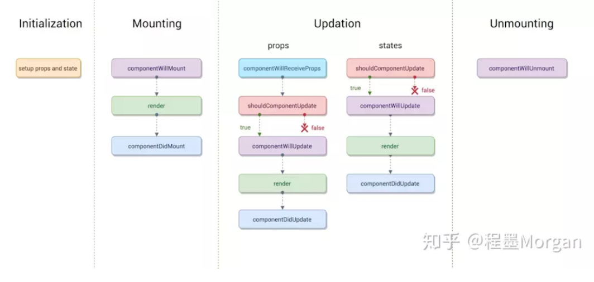
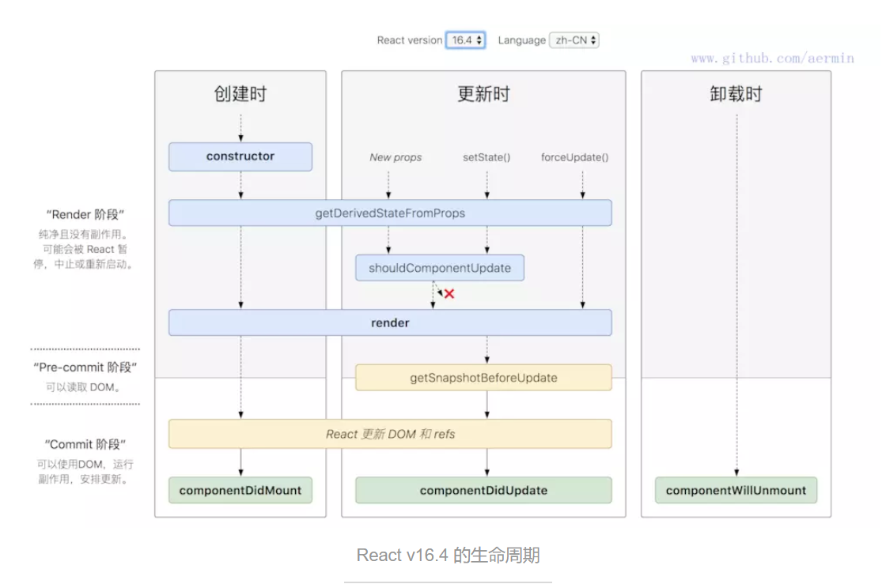

#React

##生命周期

在V16之前


组件一共经历3个阶段，Mount挂载阶段，Updation更新阶段，Unmounting卸载阶段。（还有个初始化阶段，也就是constractor）

在Mount阶段共经历，componentWillMount、render、componentDidMount

更新阶段 

无论是父组件传来props或者自身state发生改变，都会经历的有  shouldComponentUpdate、componentWillUpdate、render、componentDidUpdate.如果是组件首次渲染，则在update阶段一开始还会经历componentWillreceiveProps

销毁阶段

componentWillUnmount

在V16之后，原来（React v16.0前）的生命周期在React v16推出的Fiber之后就不合适了，因为如果要开启async rendering，在render函数之前的所有函数，都有可能被执行多次。


新版本取而代之的是用一个getDerivedStateFromProps静态函数取代了render之前所有的周期函数，（除了shouldComponentUpdate）。还在render之后新出了getSnapshotBeforeUpdate

getSnapshotBeforeUpdate() 被调用于render之后，可以读取但无法使用DOM的时候。它使您的组件可以在可能更改之前从DOM捕获一些信息（例如滚动位置）。此生命周期返回的任何值都将作为参数传递给componentDidUpdate（）。


##redux状态管理

###三大原则

1 唯一数据源

2 保持只读状态

3 数据改变只能通过纯函数来执行

###reducer,getState,dispatch,subscribe

###Redux源码
```js
let createStore = (reducer) => {
    let state;
    //获取状态对象
    //存放所有的监听函数
    let listeners = [];

    let getState = () => state;

    //提供一个方法供外部调用派发action
    let dispatch = (action) => {
        //调用管理员reducer得到新的state
        state = reducer(state, action);
        //执行所有的监听函数
        listeners.forEach((l) => l())
    }


    //订阅状态变化事件，当状态改变发生之后执行监听函数
    let subscribe = (listener) => {
        listeners.push(listener);
    }
    dispatch();
    return {
        getState,
        dispatch,
        subscribe
    }
}
let combineReducers=(renducers)=>{
    //传入一个renducers管理组，返回的是一个renducer
    return function(state={},action={}){
        let newState={};
        for(var attr in renducers){
            newState[attr]=renducers[attr](state[attr],action)

        }
        return newState;
    }
}
export {createStore,combineReducers};
```


##React Hooks

react靠状态去更新组件，但是在复杂的前端工程面前，比如复杂的SPA程序，有状态的组件复用起来会很复杂，其实react一直在管理状态上面费心思，现在Hook的出现可以说是一个很大的进步，他可以把有无状态的组件一律看成无状态的Function，从而达到状态和组件抽离。

###stateHook

```js
import { useState } from 'react';

function Example() {
  const [count, setCount] = useState(0);

  return (
    <div>
      <p>You clicked {count} times</p>
      <button onClick={() => setCount(count + 1)}>
        Click me
      </button>
    </div>
  );
}


```

Example变成了一个函数，但这个函数却有自己的状态（count），同时它还可以更新自己的状态（setCount）hook让我们的函数变成了一个有状态的函数。

useState是react自带的一个hook函数，它的作用就是用来声明状态变量。useState这个函数接收的参数是我们的状态初始值（initial state），它返回了一个数组，这个数组的第[0]项是当前当前的状态值，第[1]项是可以改变状态值的方法函数。


###EffectHook

EffectHook可以解绑一些生命周期的副作用。使代码更简洁

[原文引用来自掘金](https://juejin.im/post/5be3ea136fb9a049f9121014#heading-6) 


#数据库


###范式

原文摘自[博客](https://www.cnblogs.com/lca1826/p/6601395.html) 

__·第一范式（1NF）：属性不可分。__

__·第二范式（2NF）：符合1NF，并且，非主属性完全依赖于码。__

  （注意是完全依赖不能是部分依赖，设有函数依赖W→A，若存在XW，有X→A成立，那么称W→A是局部依赖，否则就称W→A是完全函数依赖）

__·第三范式（3NF）：符合2NF，并且，消除传递依赖__

  (也就是每个非主属性都不传递依赖于候选键，判断传递函数依赖，指的是如果存在"A → B → C"的决定关系，则C传递函数依赖于A。）

