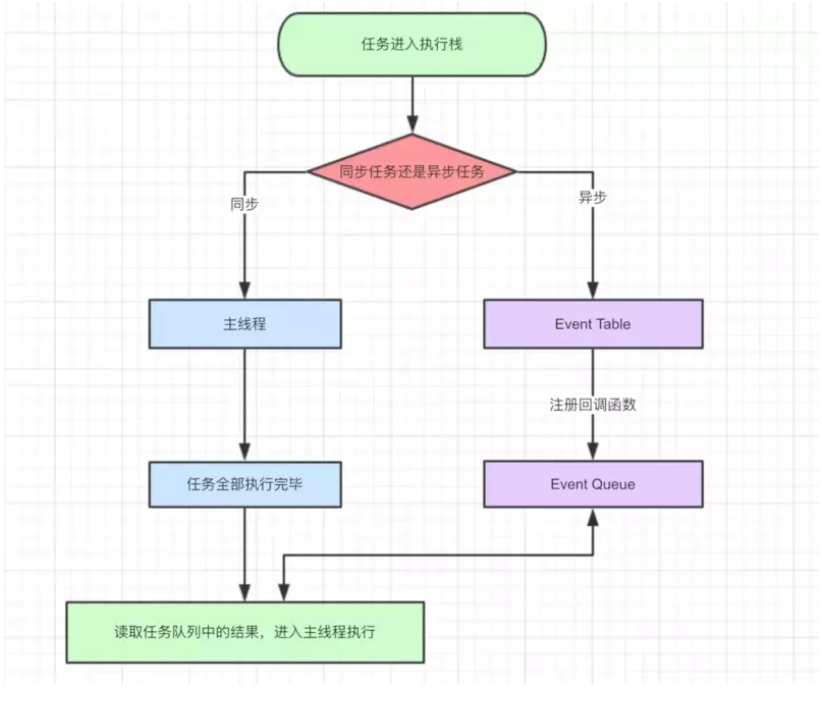

#JS相关

[近一万字的ES6语法知识点补充](https://juejin.im/post/5c6234f16fb9a049a81fcca5) 

[每个 JavaScript 工程师都应懂的33个概念](https://github.com/stephentian/33-js-concepts) 

[前端面试题讲解(THIS、构造函数、面向对象、堆栈内存以及闭包)](https://www.bilibili.com/video/av24383268) 

[JavaScript的es6详解](https://www.bilibili.com/video/av25438199) 


##跨域

原因：浏览器同源策略

不同协议，不同域名（不同二级域名），不同端口都会造成跨域

常见的方法 jsonp CORS 

###jsonp

通过动态向HTML插入script标签来请求，只能get，不能post

###CORS 

实现CORS通信的关键是服务器。只要服务器实现了CORS接口，就可以跨源通信。


##浏览器中的Event Loop

**同步任务和异步任务**

Javascript单线程任务被分为**同步任务**和**异步任务**，同步任务会在调用栈中按照顺序等待主线程依次执行，异步任务会在异步任务有了结果后，将注册的回调函数放入任务队列中等待主线程空闲的时候（调用栈被清空），被读取到栈内等待主线程的执行。



**事件循环的进程模型**

**MacroTask（宏任务）**

setTimeout、setInterval、等

**MicroTask（微任务）**
Promise等。

执行栈在执行完同步任务后，查看执行栈是否为空，如果执行栈为空，就会去检查微任务(microTask)队列是否为空，如果为空的话，就执行Task（宏任务），否则就一次性执行完所有微任务。
每次单个宏任务执行完毕后，检查微任务(microTask)队列是否为空，如果不为空的话，会按照先入先出的规则全部执行完微任务(microTask)后，设置微任务(microTask)队列为null，然后再执行宏任务，如此循环。


摘自[一次弄懂Event Loop](https://juejin.im/post/5c3d8956e51d4511dc72c200) 


**举一些ES6对String字符串类型做的常用升级优化?**

如ES6在String原型上新增了includes()方法，用于取代传统的只能用indexOf查找包含字符的方法(indexOf返回-1表示没查到不如includes方法返回false更明确，语义更清晰),

**举一些ES6对Array数组类型做的常用升级优化**

- 数组解构赋值

在声明较多变量时，不用再写很多let(var),且映射关系清晰，且支持赋默认值

- 扩展运算符
ES6新增的扩展运算符(...)(重要),可以轻松的实现数组和松散序列的相互转化，可以取代arguments对象和apply方法，轻松获取未知参数个数情况下的参数集合。（尤其是在ES5中，arguments并不是一个真正的数组，而是一个类数组的对象，但是扩展运算符的逆运算却可以返回一个真正的数组）。扩展运算符还可以轻松方便的实现数组的复制和解构赋值（let a = [2,3,4]; let b = [...a]）

ES6在Array原型上新增了find()、includes(), fill()

**举一些ES6对Number数字类型做的常用升级优化**

ES6在Number原型上新增了isFinite(), isNaN()方法，用来取代传统的全局isFinite(), isNaN()方法检测数值是否有限、是否是NaN。


**举一些ES6对Object类型做的常用升级优化?(重要)**

语法变得更简洁了，语义更加清晰

 ES6对象也可以像数组解构赋值那样
 
 进行变量的解构赋值.对象的扩展运算符(...)。

```js
let MyOwnMethods = {keys, values, entries}; // let MyOwnMethods = {keys: keys, values: values, entries: entries}
```

ES6在Object原型上新增了assign()方法，用于对象新增属性或者多个对象合并.

ES6在Object原型上还新增了Object.keys()，Object.values()，Object.entries()方法，用来获取对象的所有键、所有值和所有键值对数组


**举一些ES6对Function函数类型做的常用升级优化?**

箭头函数里没有自己的this,这改变了以往JS函数中最让人难以理解的this运行机制。

**箭头函数内的this指向的是函数定义时所在的对象**

**for...in 和for...of有什么区别？**

ES6规定，有所部署了载了Iterator接口的对象(可遍历对象)都可以通过for...of去遍历，而for..in仅仅可以遍历对象

symbol是第六种原始数据类型，所有Symbol()生成的值都是独一无二的，可以从根本上解决对象属性太多导致属性名冲突覆盖的问题。

Set是一种类似数组的新的数据结构，但是它的成员是惟一的，不重复的。（可以轻松实现去重）

Map是Object的超集，打破了一传统键值对形式定义对象，对象的key不再局限于字符串。


摘自[ES6](https://github.com/poetries/FE-Interview-Questions/blob/master/ES6.md) 
